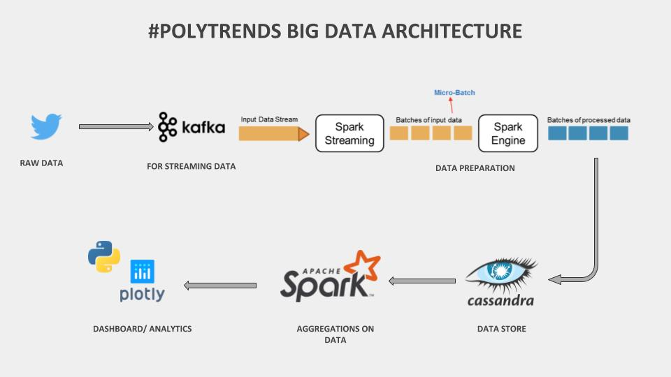

# #POLYTRENDS: ANALYSIS OF THE CANADIAN FEDERAL ELECTION ‘19

# Introduction
A huge part of discussion on twitter revolves around news and politics. This makes it an ideal platform on which to measure public opinion, especially during election campaigns. In addition to traditional quantitative measures like the count and averages, we can extract qualitative measures using sentiment analysis which provides insights on how people feel about a specific candidate. It also becomes possible to keep track of sentiment over time to see how it evolves. 

Our project analyzes English tweets over a 3 month time period referencing the Canadian federal 2019 election - which took place on October 21st 2019 - using the keyword ‘cdnpoli’ to extract tweets. By leveraging Big Data tools we tackle close to 350,000 tweets for analysis. A dashboard containing the results of our analysis will serve as a powerful tool for political campaigners to make strategic decisions on the fly. For this project we limit our analysis to three major political parties viz. Liberals, Conservatives and NDP. 
 

# Architecture

# Data Gathering
To retrieve tweets we have used a script named [Exporter.py](https://csil-git1.cs.surrey.sfu.ca/rhear/polytrends/blob/master/data/Exporter.py) which is in the 'data' directory. This script is from this [GitHub Project](https://github.com/Jefferson-Henrique/GetOldTweets-python). Instructions on how to use this script to retrieve data can be found in the [READ.md](https://github.com/Jefferson-Henrique/GetOldTweets-python/blob/master/README.md) from the original GitHub Project.

We have customized the [Exporter.py](https://csil-git1.cs.surrey.sfu.ca/rhear/polytrends/blob/master/data/Exporter.py) script to generate '\u0001' separated data instead of ';' separated data. This customization was necessary in order to handle tweets that included a ';'. 

The output of the [Exporter.py](https://csil-git1.cs.surrey.sfu.ca/rhear/polytrends/blob/master/data/Exporter.py) script are multiple files each containing tweets for a particular date. In order to obtain a single file with all the tweets we used the script names 'days_concat.py' and 'months_concat.py' to combine the daily tweets.  

Due limited computing resources, we combined the data into months initially. 

It took a total of 25 minutes to do the following (on a single machine) 
- read the incoming stream from the Kafka topic (corresponding to the tweets from August, September and October 2019 that mention 'cdnpoli')
- prepare the data (clean, tokenize, feature engineering)
- store it into the Cassandra database

# Running
Instruction for running this project are in the [RUNNING.txt](https://csil-git1.cs.surrey.sfu.ca/rhear/polytrends/blob/master/RUNNING.txt) file.
